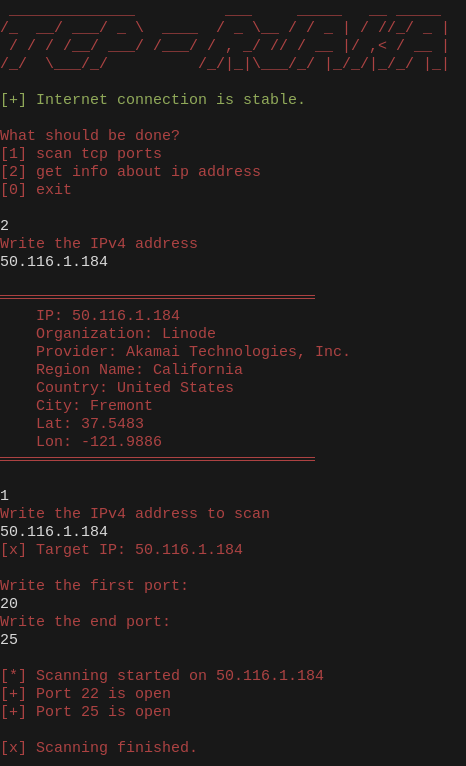

# tcp-rjaka

## installation
1. clone it
~~~
git clone https://github.com/Efesint/tcp-rjaka && cd tcp-rjaka
~~~
2. use it
~~~
cd src 
~~~
~~~
python main.py
~~~

# LICENSE 
This product is released under the GNU General Public License v3.0
